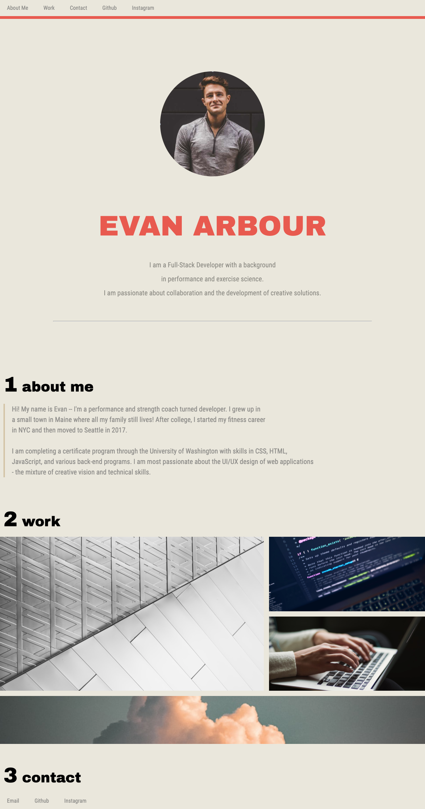

# Evan Arbour: Portfolio

## Welcome to my Work!

Hi! Thanks for checking out my portfolio. My name is Evan Arbour and I am a Seattle based web developer with a passion for UI/UX layout and design.
In my previous career, I was a nutrition and strength coach. The individuality of every client's needs as a coach is very similar to each coding
project: there are many different ways to getting the same result, everyone you ask might give you a different solution, and there is a lot of
trial and error involved ;)

I always enjoyed meeting the specific needs of my clients with the tools and training I had to give them the end-result they wanted. There was a
lot of hard work from all parties, but it was always worth it. Web Development is very similar. I am passionate about the intersection of
creativity and technical skill. I worked hard to reflect that in the layout and functionality of my portfolio. The project is easy to navigate,
has a clean look with a comination of neutral and warm tones for a professional, yet welcoming feel.

